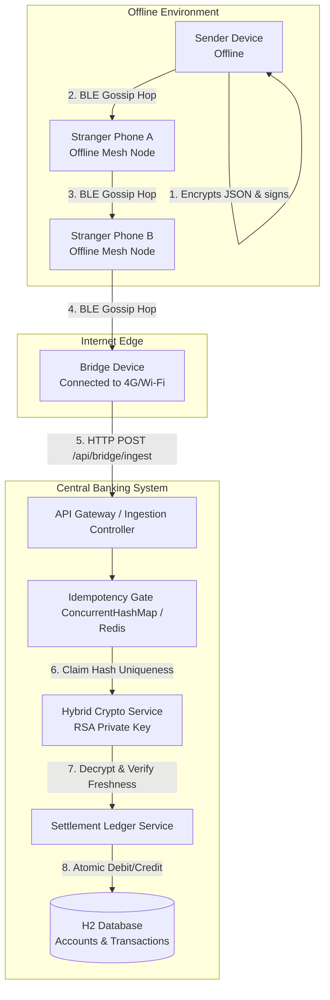
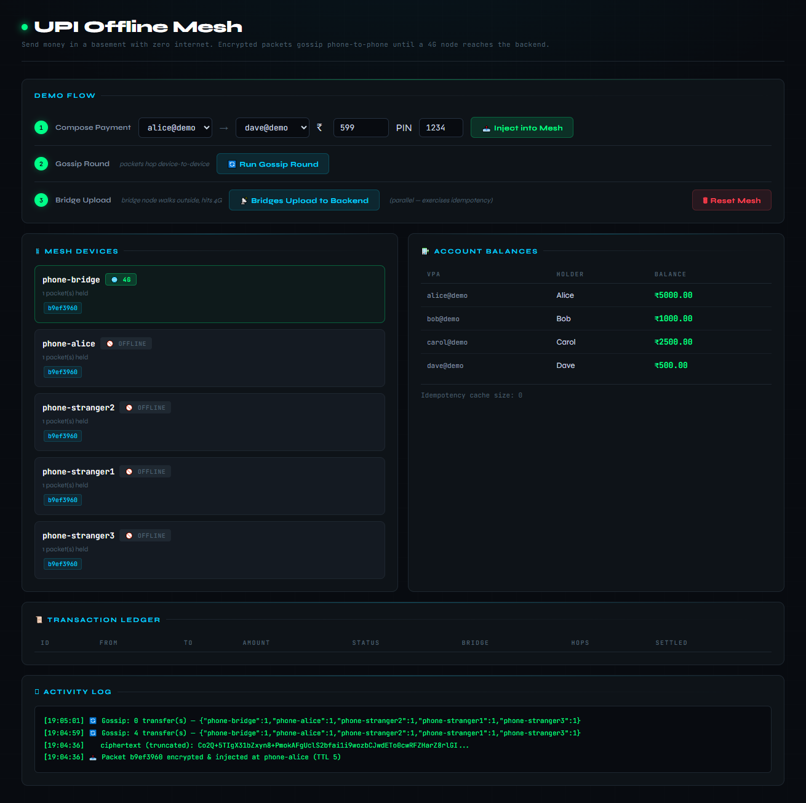
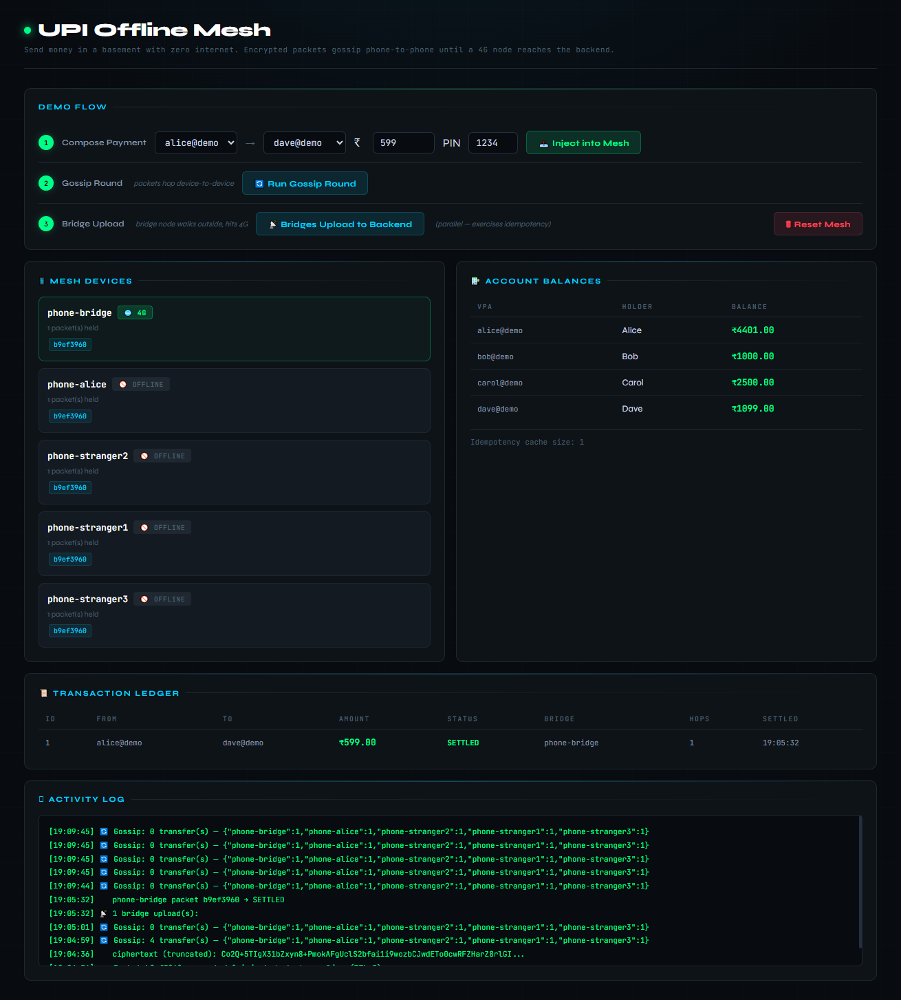

# UPI Mesh - Offline Payment System

> Send money with zero internet. A payment packet encrypts 
> on your phone, hops through nearby devices via Bluetooth 
> mesh, and settles securely the moment any device touches 
> cellular data.

---

## Problem Statement

Traditional digital payments like UPI require consistent 
internet connectivity from both payer and payee. In remote 
areas, crowded venues, or during outages, digital transactions 
completely fail  forcing reliance on physical cash.

UPI Mesh explores whether secure peer-to-peer payments can 

**Problem 1:  Strangers carry your payment. How do you stop 
them reading or modifying it?**

Hybrid RSA-OAEP + AES-256-GCM encryption. The payment is 
encrypted on the sender's device before entering the mesh. 
Intermediate phones carry an opaque ciphertext blob  
completely unreadable. One flipped bit in transit breaks 
the GCM authentication tag and the server rejects the packet.

**Problem 2:  Same packet arrives from 5 phones at once. 
How do you prevent double-charging?**

Atomic idempotency via SHA-256 + ConcurrentHashMap. The 
server computes SHA-256 of the ciphertext and atomically 
claims that hash using putIfAbsent. Even under 100 concurrent 
threads, exactly one claim succeeds  only that thread 
settles. All others return DUPLICATE_DROPPED before any 
database work begins.

**Problem 3:  An attacker replays a captured packet days 
later. How do you reject it?**

Two-layer defence. A signedAt timestamp inside the encrypted 
payload expires after 24 hours  unmodifiable without 
breaking the GCM tag. A unique nonce per payment ensures a 
replayed packet produces an identical ciphertext hash, 
already held in the idempotency cache  dropped immediately.

---

## How It Works?



---

## Tech Stack

| Layer | Technology | Purpose |
|---|---|---|
| Backend | Java 17, Spring Boot 3.3 | Core application, DI, service architecture |
| Encryption | RSA-2048, AES-256-GCM | Hybrid encryption  confidentiality + tamper detection |
| Integrity | SHA-256 | Ciphertext fingerprinting for deduplication |
| Concurrency | ConcurrentHashMap, JPA @Version | Race condition prevention, optimistic locking |
| Database | H2 In-Memory | Account ledger for demo |
| UI | HTML5, CSS3 | Real-time mesh dashboard |

---

## Key Files

| File | Responsibility |
|---|---|
| `HybridCryptoService.java` | RSA-OAEP + AES-256-GCM encrypt and decrypt |
| `BridgeIngestionService.java` | Main pipeline: hash → deduplicate → decrypt → validate → settle |
| `IdempotencyService.java` | Atomic deduplication via ConcurrentHashMap |
| `SettlementService.java` | @Transactional debit + credit + ledger write |
| `MeshSimulatorService.java` | Gossip protocol across virtual devices |
| `VirtualDevice.java` | One simulated phone in the mesh |

---

## Run It

**Windows:** `mvnw.cmd spring-boot:run`
**Mac/Linux:** `./mvnw spring-boot:run`
**Open:** `http://localhost:8080`

JDK 17+ is the only requirement. First run downloads 
dependencies (~80 MB).

---

## Demo Flow

### Step 1  Gossip propagation
All 5 virtual devices receive the encrypted packet. 
Balances unchanged  nothing has settled yet.



### Step 2  Settlement
Bridge node walks outside, gets 4G, uploads to backend. 
Pipeline runs: hash → deduplicate → decrypt → settle. 
Ledger shows SETTLED. Alice's balance decreases by ₹599.

 
---

## Headline Test

```cmd
mvnw.cmd test -Dtest=IdempotencyConcurrencyTest
```

3 threads deliver the same packet simultaneously.
Result: 1 SETTLED · 2 DUPLICATE_DROPPED · balance changes once.

---

## API Reference

| Method | Path | Description |
|---|---|---|
| GET | `/` | Interactive dashboard |
| GET | `/api/accounts` | All accounts and balances |
| GET | `/api/transactions` | Last 20 settled transactions |
| GET | `/api/mesh/state` | State of all virtual devices |
| POST | `/api/demo/send` | Encrypt and inject payment into mesh |
| POST | `/api/mesh/gossip` | Run one gossip round |
| POST | `/api/mesh/flush` | Bridge nodes upload to backend |
| POST | `/api/mesh/reset` | Reset mesh and idempotency cache |
| POST | `/api/bridge/ingest` | Main ingest endpoint |